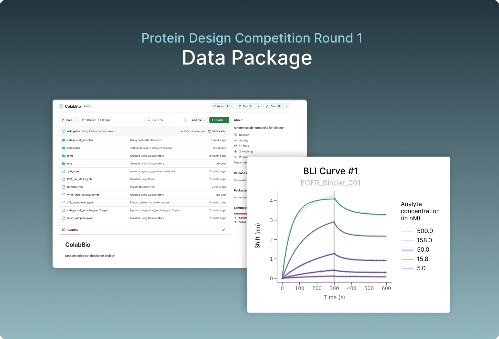

This repo contains the results data for Adaptyv Bio’s [EGFR Protein Design Competition](https://design.adaptyvbio.com/).

- Processed characterization data can be found in the [results](results) folder
- Raw lab data and BLI curves can be downloaded here:

```
https://api.adaptyvbio.com/storage/v1/object/public/egfr_design_competition/package.zip
```

# Methods

## Metrics

### PAE Scores

The designs were first assessed using the **PAE_interaction** metric. To calculate this, we began by generating a structural prediction using ColabFold (with 2 models, 5 recycles, and no initial guess or templates). The Predicted Aligned Error (PAE) of the top-ranked prediction was then averaged across residue pairs, where one residue belongs to the target and the other to the binder, as done [here](https://github.com/nrbennet/dl_binder_design/blob/cafa3853ac94dceb1b908c8d9e6954d71749871a/af2_initial_guess/predict.py#L197).

### pLDDT Scores

For each design we also computed the corresponding predicted Local Distance Difference Test (pLDDT) scores from AlphaFold2. Instead of considering the entire protein complex, we focused exclusively on the binder chain, excluding other regions. We computed the average pLDDT score over all residues of the binder chain alone.

### Sequence Similarity Check

We checked each sequence against several databases of known sequences. As part of the initial competition rules, only proteins that were more than 10 amino acids (AA) away from a known binder were considered valid and counted in the final leaderboard. The results of that similarity search are stored in the “similarity_check” column. The similarity check metric is calculated as `identity * coverage`, where:

•	**Identity** is the percentage of matching amino acids between the a subsequence of the query and a subsequence of the database entry.

•	**Coverage** is the proportion of the query sequence that aligns with a database entry.

Proteins with less than 10 amino acid distance to a database entry were excluded from the competition. A `similarity_check` value of “null” indicates that no matches were found in any of the the databases.

The databases that we checked are SwisssProt, THPdb, USPTO and binders designed by [Cao et al. (2022)](https://www.nature.com/articles/s41586-022-04654-9). The scripts can be found in the [scripts](scripts) folder.

## Experimental Workflow

### DNA Design

The submitted protein sequences were reverse-translated, and the corresponding DNA sequences were optimized using Adaptyv's internal pipeline. This process considered several parameters, including optimal codon usage for cell-free systems, mRNA secondary structure stability, and synthesizability factors. Additionally, non-coding regions at the 5' and 3' ends, optimized for cell-free expression, were incorporated into the coding sequences. Suitable gene constructs were successfully generated for all submitted protein sequences.

### Protein Synthesis

Protein synthesis was carried out using an optimized cell-free expression system, suitable for a wide range of proteins. The template DNA was added, and protein expression was conducted over a defined period. During the competition, at least two expression batches were performed for each sequence entry, with some sequences tested up to four times under varying conditions. Protein synthesis success was assessed via a label-free quantification assay. Sequences that yielded less than 0.02 µg/mL of protein were excluded from further experimental characterization.

### Binding Assay

The binding assay was conducted using Bio-Layer Interferometry (BLI), a label-free technology for biomolecular interaction measurement. A multi-cycle kinetic assay was performed against the target antigen. Expressed ligands were immobilized on the probe surface using tag-specific chemistry, and several concentrations of the antigen (ranging from 316.2 nM to 10 nM) were flowed over the probe. The experiments were performed in duplicate using a PBS-T buffer with 0.02% BSA at 25°C.

### Data analysis

To get the final KD values, we fit the BLI curves to a 1:1 binding model. For the curves where a KD value could not be estimated, we say that binding is weak (if the BLI signal is strong) or unknown (if the protein did not express or if the signal is weak compared to negative controls).
